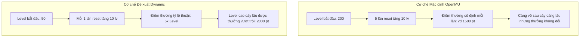

# Báo Cáo Phân Tích & So Sánh Cơ Chế Reset Nhân Vật Trong OpenMU

> **Mục đích tài liệu:** Báo cáo kỹ thuật và toán học chi tiết so sánh giữa **Cơ chế Reset Tích lũy theo Cấp độ (Proposed Dynamic Reset System)** và **Cơ chế Reset Mặc định hiện tại của OpenMU (Default OpenMU Ladder System)**. Tài liệu phục vụ đánh giá cân bằng game, trải nghiệm người chơi và mô phỏng tối ưu hóa hệ thống.

---

## 1. Tổng Quan Bài Toán & Đề Xuất Mới

### 1.1. Ý tưởng cốt lõi
* **Giữ nguyên bảng EXP gốc của MU Online** (độ khó tăng nhanh ở các mốc level cao).
* **Reset không cố định level 400**, mà khởi đầu sớm từ **Level 50** và tăng tịnh tiến **+10 level** sau mỗi lần reset cho đến khi chạm mốc Level 400.
* **Điểm thưởng tích lũy (Reward Points)**: Điểm nhận được ở mỗi lần reset tỷ lệ thuận trực tiếp với chính cấp độ yêu cầu của lần đó ($P_k = 5 \times \text{RequiredLevel}_k$).

---

## 2. Mô Hình Toán Học Chi Tiết (Cơ Chế Đề Xuất)

### 2.1. Xác định số lần Reset ($n$)
Dãy cấp độ yêu cầu $L$ tạo thành một cấp số cộng:
* Cấp độ lần đầu ($L_1$): $50$
* Công sai / Bước nhảy ($d$): $10$
* Cấp độ tối đa ($L_n$): $400$

Công thức xác định số lần reset tối đa $n$:
$$L_n = L_1 + (n - 1) \cdot d$$
$$400 = 50 + (n - 1) \cdot 10 \implies n = \mathbf{36 \text{ lần}}$$

---

### 2.2. Công thức tính tổng điểm tích lũy ($S$)
Ở lần reset thứ $k$ (với cấp độ yêu cầu $L_k$), người chơi nhận thêm lượng point:
$$P_k = \alpha \times L_k$$
*(Trong đó $\alpha = 5$ đối với class cơ bản: DK, DW, ELF, SUM; $\alpha = 7$ đối với MG, DL).*

Tổng điểm tích lũy sau $n=36$ lần reset:
$$S = \sum_{k=1}^{36} (\alpha \times L_k) = \alpha \times \sum_{k=1}^{36} L_k$$

Tổng các cấp độ yêu cầu:
$$\sum_{k=1}^{36} L_k = \frac{(L_1 + L_{36}) \times 36}{2} = \frac{(50 + 400) \times 36}{2} = 8,100$$

* **Tổng điểm cho Class chuẩn ($\alpha = 5$):**
  $$S_{\text{Standard}} = 5 \times 8,100 = \mathbf{40,500 \text{ points}}$$
* **Tổng điểm cho Class đặc biệt ($\alpha = 7$ - MG/DL):**
  $$S_{\text{Special}} = 7 \times 8,100 = \mathbf{56,700 \text{ points}}$$

> [!NOTE]
> **Điểm thực tế khi nhân vật đạt đỉnh:**
> Sau khi reset lần thứ 36 (trở về Level 1 với $40,500$ điểm gốc), nếu nhân vật luyện tiếp lên lại Level 400 ở chu kỳ cuối cùng, nhân vật nhận thêm $(400 - 1) \times 5 = 1,995$ point từ level hiện tại.
> $\rightarrow$ **Tổng điểm tối đa khả dụng khi đạt Level 400 cuối cùng: $42,495$ point.**

---

### 2.3. Bảng Dữ Liệu Chi Tiết 36 Lần Reset

| Lần Reset ($k$) | Level Yêu Cầu ($L_k$) | Point Nhận Lần Này ($5 \times L_k$) | Tổng Point Tích Lũy Sau Reset | Tổng Point (MG/DL $\alpha=7$) |
| :---: | :---: | :---: | :---: | :---: |
| **1** | 50 | 250 | 250 | 350 |
| **2** | 60 | 300 | 550 | 770 |
| **3** | 70 | 350 | 900 | 1,260 |
| **4** | 80 | 400 | 1,300 | 1,820 |
| **5** | 90 | 450 | 1,750 | 2,450 |
| **6** | 100 | 500 | 2,250 | 3,150 |
| **7** | 110 | 550 | 2,800 | 3,920 |
| **8** | 120 | 600 | 3,400 | 4,760 |
| **9** | 130 | 650 | 4,050 | 5,670 |
| **10** | 140 | 700 | 4,750 | 6,650 |
| **11** | 150 | 750 | 5,500 | 7,700 |
| **12** | 160 | 800 | 6,300 | 8,820 |
| **13** | 170 | 850 | 7,150 | 10,010 |
| **14** | 180 | 900 | 8,050 | 11,270 |
| **15** | 190 | 950 | 9,000 | 12,600 |
| **16** | 200 | 1,000 | 10,000 | 14,000 |
| **17** | 210 | 1,050 | 11,050 | 15,470 |
| **18** | 220 | 1,100 | 12,150 | 17,010 |
| **19** | 230 | 1,150 | 13,300 | 18,620 |
| **20** | 240 | 1,200 | 14,500 | 20,300 |
| **21** | 250 | 1,250 | 15,750 | 22,050 |
| **22** | 260 | 1,300 | 17,050 | 23,870 |
| **23** | 270 | 1,350 | 18,400 | 25,760 |
| **24** | 280 | 1,400 | 19,800 | 27,720 |
| **25** | 290 | 1,450 | 21,250 | 29,750 |
| **26** | 300 | 1,500 | 22,750 | 31,850 |
| **27** | 310 | 1,550 | 24,300 | 34,020 |
| **28** | 320 | 1,600 | 25,900 | 36,260 |
| **29** | 330 | 1,650 | 27,550 | 38,570 |
| **30** | 340 | 1,700 | 29,250 | 40,950 |
| **31** | 350 | 1,750 | 31,000 | 43,400 |
| **32** | 360 | 1,800 | 32,800 | 45,920 |
| **33** | 370 | 1,850 | 34,650 | 48,510 |
| **34** | 380 | 1,900 | 36,550 | 51,170 |
| **35** | 390 | 1,950 | 38,500 | 53,900 |
| **36** | 400 | 2,000 | **40,500** | **56,700** |

---

## 3. Cơ Chế Mặc Định Hiện Tại Của Mã Nguồn OpenMU

Trong mã nguồn OpenMU (`MUnique.OpenMU.GameLogic.Resets`):
1. **Quy luật Level:** `ResetProgressionCalculator.GetRequiredLevel()`
   * Công thức: $\text{RequiredLevel} = 200 + \lfloor \frac{\text{CurrentReset}}{5} \rfloor \times 10$ (giới hạn trong đoạn $[200, 400]$).
   * Cứ 5 lần reset mới tăng 10 level. Để đạt mốc level 400 cần tới **100+ lần reset**.
2. **Quy luật Point:** `ResetConfiguration`
   * Thường dùng mức cố định theo lần: $\text{Points} = \text{PointsPerReset} \times \text{NextResetCount}$ (ví dụ $1,500 \times k$).
   * Hoặc cấu hình chia theo phân đoạn cố định (`PointsTiers`).

---

## 4. Phân Tích & So Sánh Đa Chiều

### 4.1. Tâm lý người chơi & Tỷ lệ giữ chân (Player Retention)
* **Giai đoạn Early-Game (Cực kỳ xuất sắc):**
  * *OpenMU mặc định:* Yêu cầu cày một mạch lên Lv 200/400. Người chơi mới với trang bị tân thủ rất dễ nản khi tốc độ lên cấp chậm dần.
  * *Đề xuất:* Đạt Level 50 chỉ mất vài phút. Reset lần 1 nhận ngay 250 point $\rightarrow$ Tăng sức mạnh tức thì, tạo vòng lặp hưng phấn (**Early Gratification Loop**).
* **Giai đoạn Mid & Late-Game (Động lực lớn):**
  * Ở các mốc 350–400, lượng EXP cần cày tăng vọt. Với cơ chế đề xuất, mỗi lần reset đem lại lượng điểm cực lớn (1,750 – 2,000 point), giúp người chơi cảm nhận rõ ràng giá trị công sức bỏ ra (**Proportional Reward Compensation**).

### 4.2. Tính cân bằng chỉ số (Stat Balance)
* Tổng $40,500$ point cho phép phân bổ trung bình khoảng **$10,000$ point mỗi cột** (Strength, Agility, Vitality, Energy) cho 4 chỉ số chính.
* Đây là con số lý tưởng trong hệ thống Season chuẩn:
  * Tránh lỗi tràn số (Attack Speed bug / Agility bug) vốn hay xảy ra khi point vượt quá $32,767$ hoặc $65,000$.
  * Giữ được tính đa dạng trong lối xây dựng nhân vật (Build diversity) thay vì max toàn bộ cột.

---

## 5. Các Vấn Đề Chuyên Sâu Cần Thẩm Định & Tối Ưu (Open Questions for High-Level AI)

1. **Tốc độ tiêu thụ nội dung (Content Consumption Pacing):**
   * Với 36 lần reset và bảng EXP gốc, tổng thời gian cày cuốc (Time to Max Cap) của người chơi trung bình (chơi 3–4 tiếng/ngày) và Hardcore (chơi 12+ tiếng/ngày) là bao nhiêu ngày?
2. **Cân bằng Class MG/DL:**
   * MG và DL với hệ số $\alpha=7$ sẽ đạt $56,700$ point (chênh $16,200$ point so với class khác). Mức chênh lệch này có gây mất cân bằng PvP/PvE quá lớn ở giai đoạn cuối không? Có nên áp dụng hệ số chung $\alpha=5$ cho point reset và chỉ giữ $+7$ point ở level thường?
3. **Cơ chế Endgame sau lần 36:**
   * Khi người chơi đạt lần reset 36 (Level 400), hệ thống nên:
     * *Lựa chọn A:* Khóa ở mốc 36 (Max Reset - chuyển sang Master Level / Hunt Boss / PvP).
     * *Lựa chọn B:* Cho phép tiếp tục reset ở mốc cố định Level 400 nhưng giảm điểm thưởng (ví dụ $+500$ point/lần) hoặc chuyển sang thưởng đơn vị tiền tệ/ danh vọng (WCoins, Ruud, Master Points).
4. **Chi phí kinh tế (Zen & Item Costs):**
   * Nên thiết lập công thức Zen yêu cầu và nguyên liệu (Chaos, Creation, Jewel of Bless/Soul) theo cấp số cộng hay hàm mũ để tương thích với lượng Zen nhặt được theo từng dải level?

---
*Tài liệu được khởi tạo tự động từ phiên làm việc phân tích thiết kế hệ thống Reset.*
